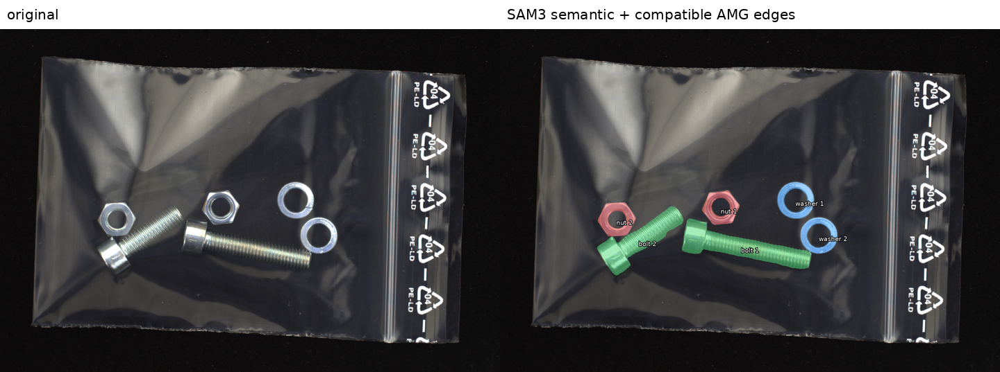
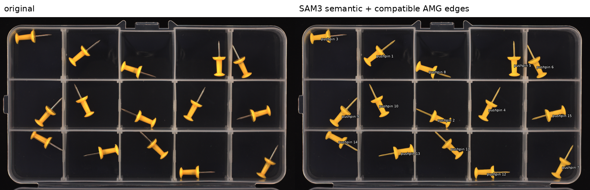

# Training-free logical and structural anomaly detection

Research code for MVTec LOCO anomaly detection using frozen visual encoders and
normal-only statistical modeling. No gradient optimization is used by the
current method.

## Current baseline

The frozen baseline is documented and implemented in [`baseline/`](baseline/):

```text
hierarchical-max(B0, composition) + S0 + S1
```

- B0 models SAM-weighted DINO visual-word totals.
- Composition independently models normalized visual-word proportions.
- S0/S1 are frozen WRN PatchCore memories at two input resolutions.
- Every calibration statistic is estimated from `train/good` only.

Five-category MVTec LOCO image-level AUROC:

| Logical | Structural | Overall |
|---:|---:|---:|
| 0.9405 | 0.9007 | 0.9207 |

This is a full-data, training-free protocol: all available normal training
images are used to form non-parametric/statistical reference models.

## Current component-graph experiment (2026-08-24)

The current experiment removes the DINO visual-word assignment step from
component identity.  Its single active pipeline is:

1. Generate one isolated reference image for each semantic component type.
2. Put the generated exemplars and the normal anchor image on one canvas.
3. Query SAM3 with both the component text and its positive visual exemplar.
4. Resolve duplicate/cross-type masks by overlap and confidence.
5. Snap a semantic mask to a SAM2 AMG proposal only when their IoU is at least
   0.8; otherwise retain the complete SAM3 mask.  Add non-overlapping AMG
   residuals, then derive one background-complement mask.
6. Track every anchor mask ID independently with SAM2.  A repeated component
   therefore remains multiple graph nodes rather than being pooled by type.
7. Represent each node by geometry plus a centered-mask Qwen3-VL embedding;
   represent pairwise spatial relations as graph edges.  Fit normal-only
   statistical models without gradient training.

The generated exemplars needed to reproduce the two validated anchors are in
[`assets/component_exemplars/`](assets/component_exemplars/).  Runtime masks,
features, model weights, and per-image caches remain excluded from Git.

### Anchor-mask validation

| Object / anchor | Raw SAM3 target masks | Resolved semantic instances | Composition | AMG residuals | Result |
|---|---:|---:|---|---:|---|
| `screw_bag/011` | 8 | 6 | 2 bolts + 2 nuts + 2 washers | 0 | all six physical objects recovered |
| `pushpins/037` | 17 | 15 | 15 independent pushpins | 0 | matches manual instance count |

For `screw_bag`, nut and bolt queries each returned exactly the two expected
instances.  The washer query additionally responded to both nuts at lower
scores; overlap competition retained the higher-confidence nut labels.  AMG
edge snapping was accepted for both nuts and both washers (IoU 0.926--0.966).
The bolt AMG proposals were fragmented (best IoU 0.331 and 0.717), so the full
SAM3 bolt masks were retained.

For `pushpins`, the 17 raw target masks contained two duplicate pairs (IoU
0.942 and 0.992).  Overlap competition reduced them to the correct 15 physical
instances.  Six masks accepted compatible AMG boundaries; the other nine kept
the complete SAM3 boundaries.  No additional AMG-only component survived the
residual test in either anchor.





### Current image-level performance

The component graph has so far been scored end-to-end only on `juice_bottle`.
This is a validation split with 20 normal images per flavor for fitting and 10
per flavor for calibration, not the repository's full-data protocol.

| Scorer | Logical AUROC | Structural AUROC | Overall AUROC |
|---|---:|---:|---:|
| Qwen node semantics | 0.8872 | 0.8757 | 0.8826 |
| mask-ID graph geometry | 0.8625 | 0.7843 | 0.8313 |
| semantic + geometry evidence | **0.9156** | **0.8730** | **0.8987** |

The other four LOCO objects have not yet produced end-to-end AUROC under this
new fused-mask pipeline.  The runner is present for the next experiment; this
README intentionally does not report numbers from older mask definitions as
if they belonged to the current version.

### Main entry points

- `baseline/src/run_sam3_exemplar_component_probe.py`: text + generated visual
  exemplar search.
- `baseline/src/run_sam2_amg_probe.py`: official SAM2 AMG proposals.
- `baseline/src/fuse_sam3_exemplar_with_amg.py`: overlap competition, compatible
  AMG edge snapping, exclusive masks, and background complement.
- `baseline/src/run_sam2_component_graph_probe.py`: mask-ID tracking and graph
  geometry.
- `baseline/src/run_qwen_node_semantic_graph_probe.py`: centered component crops,
  Qwen node embeddings, and juice-bottle evaluation.
- `baseline/src/run_multiclass_qwen_component_graph_probe.py`: next full runner
  for `breakfast_box`, `pushpins`, `screw_bag`, and `splicing_connectors`.

Set `QWEN3_VL_EMBEDDING_PATH` to the local Qwen3-VL-Embedding-8B checkpoint on
the new machine.  SAM2/SAM3 checkpoints and datasets are referenced by local
paths near the top of each experimental runner and are not committed.

## Repository layout

- `baseline/`: frozen current method, portable configuration, tests, and result summary.
- `code/`: DINO/SAM preprocessing and earlier branch-B implementation.
- `structural_patch_memory/`: S0/S1 extraction and memory-bank experiments.
- `relational_word_statistics/`: relation and composition ablations; not part of the current baseline.

Datasets, pretrained weights, feature caches, runtime caches, and per-image
result archives are intentionally excluded from Git.

## Status

This repository is currently intended for private research collaboration. The
reported LOCO configuration was selected during exploratory development; use a
frozen protocol on additional data before making a strict SOTA claim.
